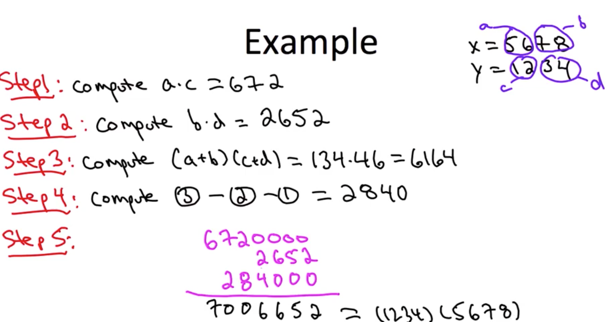
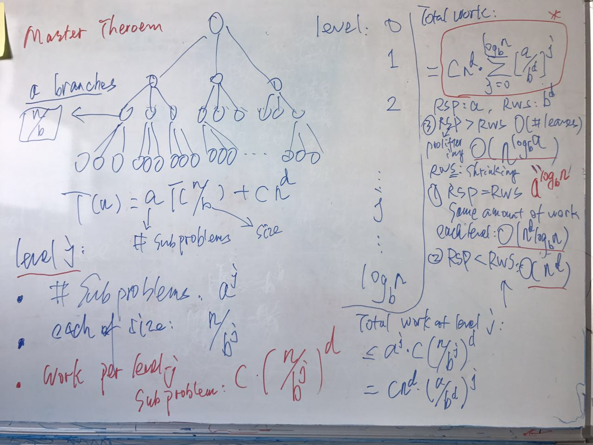
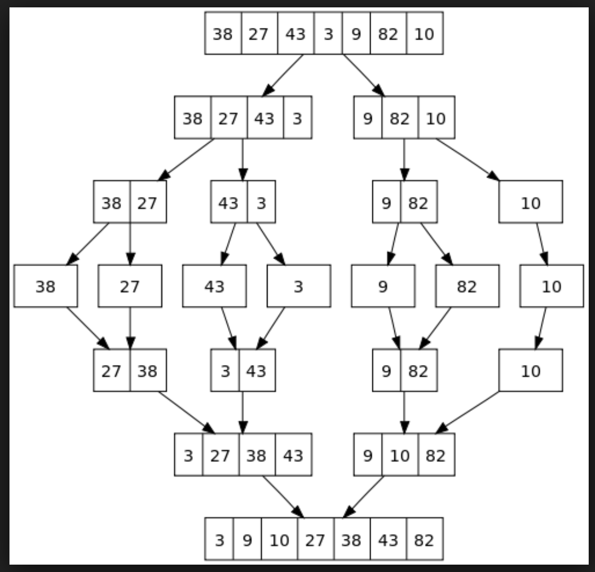
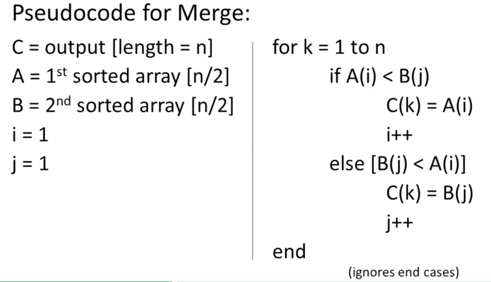
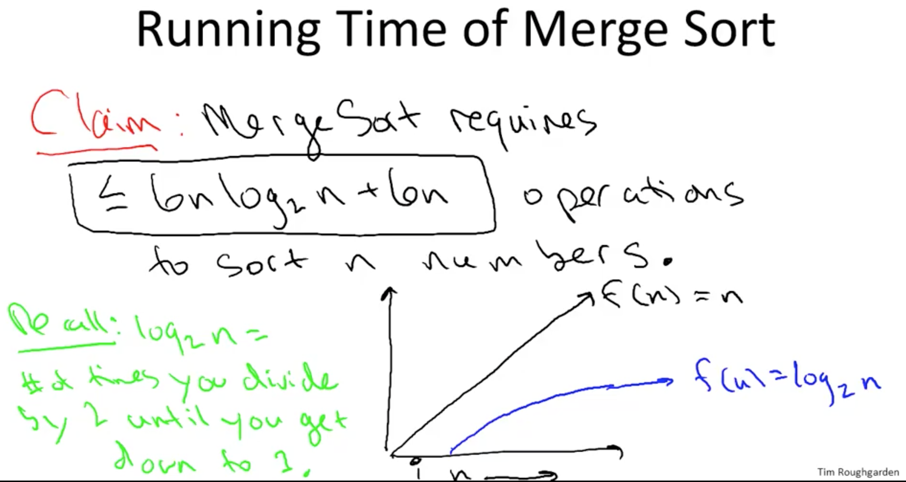
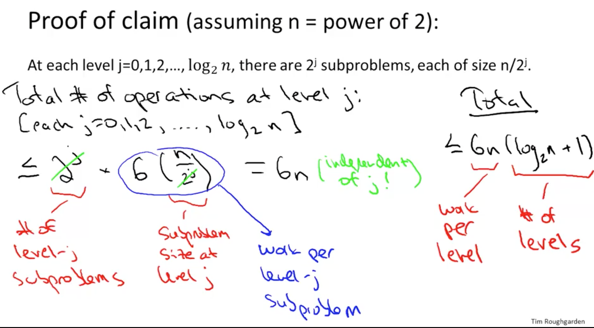
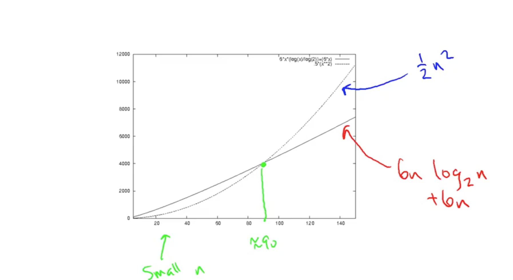
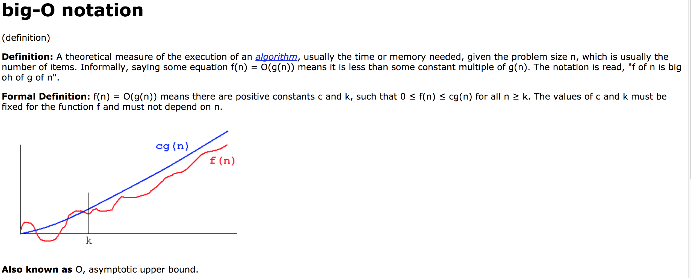

# Divid and conque

## Karatsuba multiplication
- improvement of 3 grade multiply algorithm  
    Note that  The steps below avoid a multiplication step **(ad+bc) = (a+b)(c+d)-ac-bd**
      
    Complexity: $O(n^{log_23})$
      http://moais.imag.fr/membres/denis.trystram/SupportsDeCours/Karatsuba.pdf
    Theory:       http://www.cse.unt.edu/~tarau/teaching/cf1/Master%20theorem.pdf
      
      `RSP: rate of subproblem proliferation, RWS: rate of work shrinkage per sub-problem`
    - **Master theorem**
      $T(n)=aT(n/b)+f(n)$, $f(n) = \Theta(n^d) $
      $
        T(n)=\begin{cases}
                     \Theta(n^d), & \text{if d>}log_b(a)\\
                     n^dlog(n), & \text{if d=}log_b(a)\\
                     n^{(log_b(a))}, & \text{if d<}log_b(a)
                  \end{cases}
      $

      https://www.youtube.com/watch?v=T68vN1FNY4o
      [Karatsuba multiply implementation in scala](https://goo.gl/mC6s7p)

## Find maximum subarray
  - Runtime: $nlog(n)$
    [Find maximum subarray implementation in scala](https://goo.gl/SKDvHk)

## Count inversions
  - Runtime: $nlog(n)$
    [Count inversions implementation in scala](https://goo.gl/zUQdRA)

## merge sort
- Implementation
  [Merge sort in scala](https://goo.gl/wxDNXN)
- Running time = # of lines of code executed.
- An example of merge sort process
    + 
- How many of lines executed of merge sort required?
    + Subroutine: merge 6m -> (4n+2)
    
    + Runtime of merge sort analysis:
    
    + At each level j=0,1,2,...,log₂(n), there are 2ʲ subproblems,each of size of n/2ʲ
    + Merge sort runtime
    
    + Runtime merge sort vs insertion,insertion sort is better when n< 90 than merge sort
    
    + What is a fast algorithm? worst case running time **grows slowly** with input size.
- Big Oh notation
    + 
    + big oh notation : https://www.quora.com/What-is-the-difference-between-big-oh-big-omega-and-big-theta-notations
        - big Oh: worst case, $f(n)<= cg(n)$,
        - big Omega: best case $f(n)>=cg(n)$,
        - theta: $f(n)$ bounded $f(n) = O(g(n))$ and $f(n) = Ω(g(n))$
    * $2^{n+10}$ is $O(2^n)$, $2^{10n}$ is **NOT** $O(2^n)$
    * 3-way-merge sort, O(log₃n) = O(log₂n) , since log₂(n) = log₃(n) / log₃(2)
    * What if we use spark with 100 vcore to run the merge sort program? the running time still is nlog₂(n), 100 times faster but 100 is a constant faster.
    * You are given functions f and g such that f(n)=O(g(n)). Is f(n)∗log₂(f(n)ᶜ)=O(g(n)∗log₂(g(n))) ? True, since log₂(f(n)ᶜ) = clog₂(f(n))
    * Assume again two (positive) nondecreasing functions f and g such that $f(n)=O(g(n))$. Is $2^{f(n)}=O(2^{g(n)})$ ?
      Yes if $f(n) \leq  g(n)$ for all sufficiently large n.
    * k-way-merge sort, k sorted arrays, each with n elements. merge subroutine one by one, $(2n+3n+...+kn=\dfrac {nk(1+k)}2)$ -> $O(nk^2)$
    * Arrange the following functions in increasing order of growth rate (with $g(n)$ following $f(n)$ in your list if and only if $f(n)=O(g(n)))$.
        a)  $\sqrt{n}$ -> $\dfrac12log(n)$
        b)  $10^n$ -> $nlog(10)$
        c)  $n^{1.5}$ -> $1.5log(n)$
        d)  $2^{\sqrt{log(n)}}$ -> $\sqrt{log(n)}log(2)$
        e)  $n^{5/3}$ -> $\dfrac53log(n)$
        Answer: **daceb**
