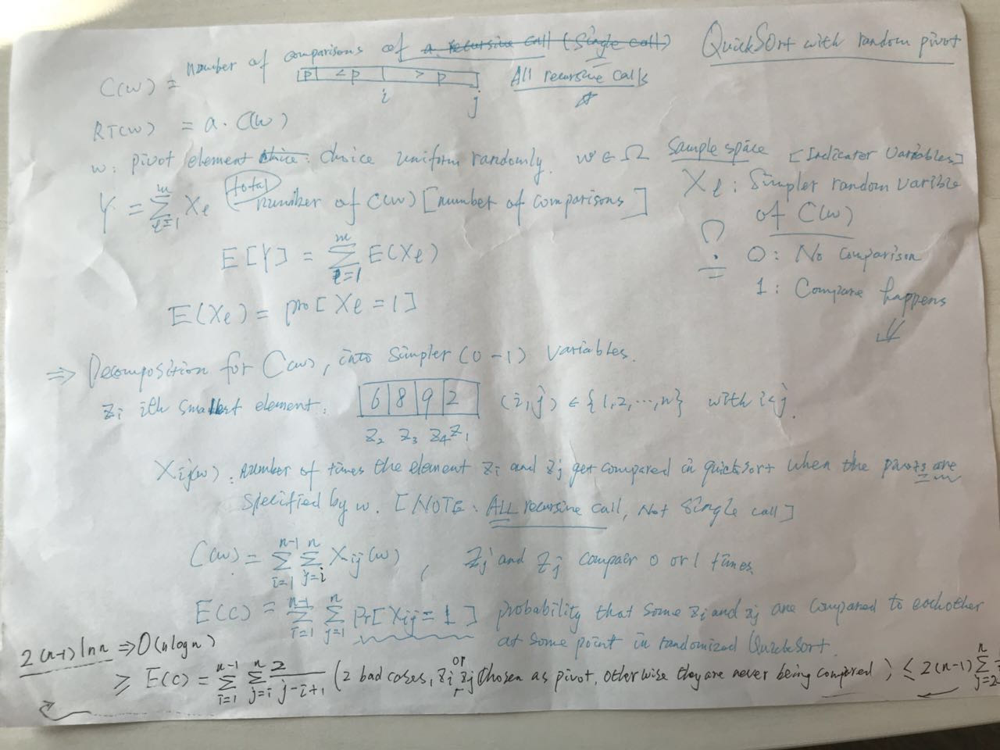
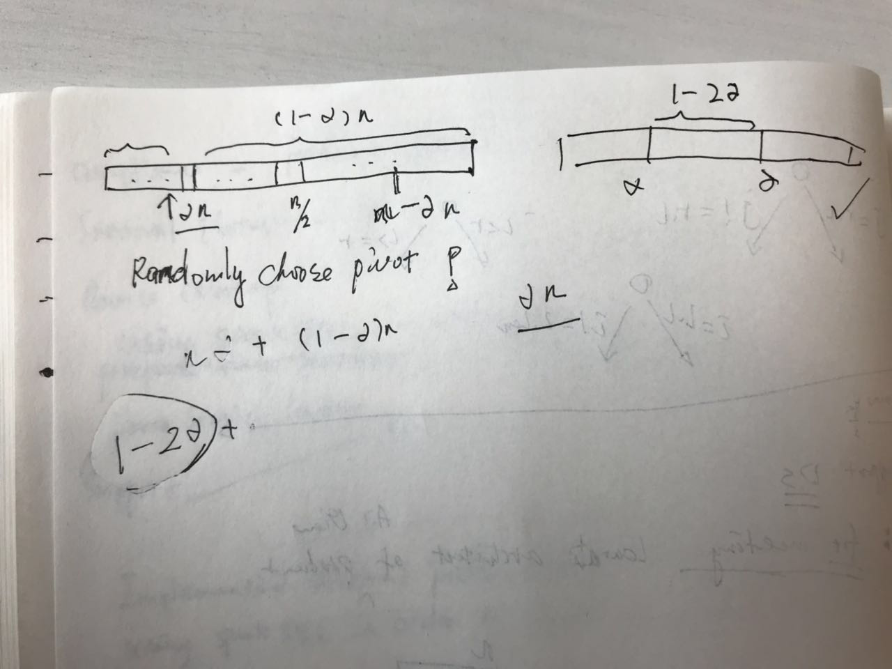
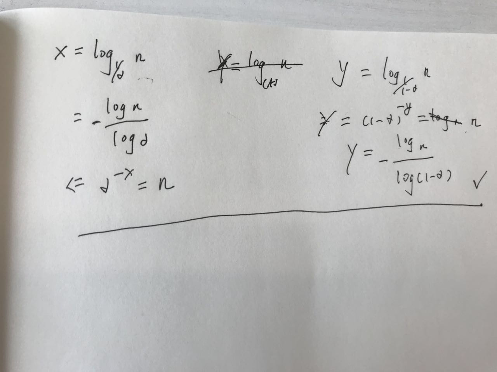
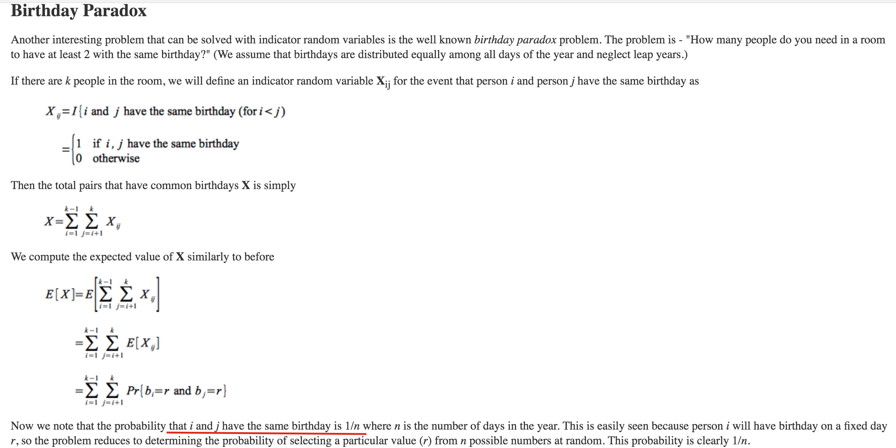
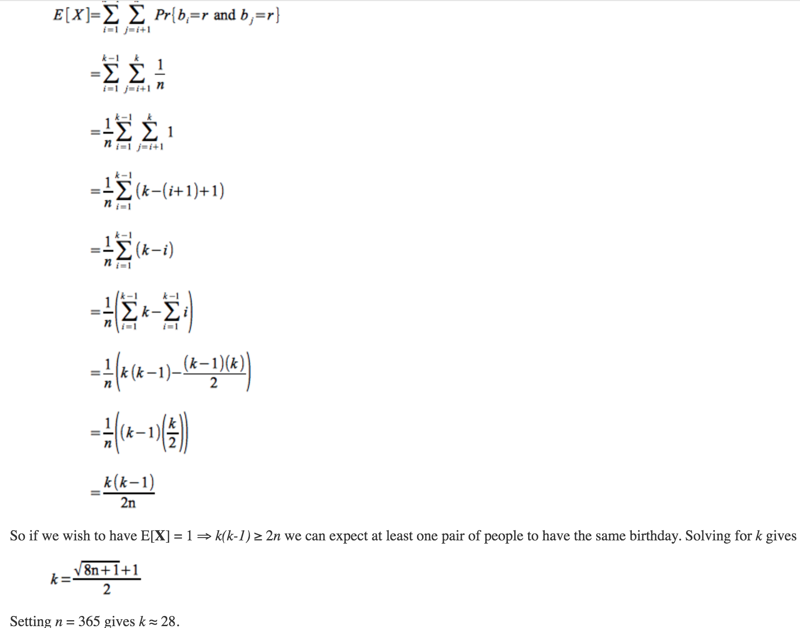

## Quicksort



### Problems set
1. Let $0\lt \alpha \lt .5$ be some constant (independent of the input array length $n$). Recall the Partition subroutine employed by the QuickSort algorithm, as explained in lecture. What is the probability that, with a randomly chosen pivot element, the Partition subroutine produces a split in which the size of the smaller of the two subarrays is $\ge \alpha$ times the size of the original array?
**Solution**: $1-2*\alpha$
  
2. Now assume that you achieve the approximately balanced splits above in every recursive call --- that is, assume that whenever a recursive call is given an array of length $k$, then each of its two recursive calls is passed a subarray with length between $\alpha k$ and $(1-\alpha)k$ (where $\alpha$ is a fixed constant strictly between 0 and $.5$). How many recursive calls can occur before you hit the base case? Equivalently, which levels of the recursion tree can contain leaves? Express your answer as a range of possible numbers $d$, from the minimum to the maximum number of recursive calls that might be needed.
  **Solution**: $-\frac{\log(n)}{\log(\alpha)} \le d \le -\frac{\log(n)}{\log(1-\alpha)}$
  
3. Define the recursion depth of QuickSort to be the maximum number of successive recursive calls before it hits the base case --- equivalently, the number of the last level of the corresponding recursion tree. Note that the recursion depth is a random variable, which depends on which pivots get chosen. What is the minimum-possible and maximum-possible recursion depth of QuickSort, respectively?
  **Solution**: Minimum: $\Theta(\log(n))$ ; Maximum: $\Theta(n)$
4. Consider a group of $k$ people. Assume that each person's birthday is drawn uniformly at random from the 365 possibilities. (And ignore leap years.) What is the smallest value of $k$ such that the expected number of pairs of distinct people with the same birthday is at least one?
[Hint: define an indicator random variable for each ordered pair of people. Use linearity of expectation.]
  **Solution**:28
  
  
  See more from [here](https://goo.gl/LtjLSu)
5. Let $X_1,X_2,X_3$ denote the outcomes of three rolls of a six-sided die. (I.e., each $X_i$ is uniformly distributed among ${1,2,3,4,5,6}$, and by assumption they are independent.) Let $Y$ denote the product of $X_1$ and $X_2$ and $Z$ the product of $X_2$ and $X_3.$ Which of the following statements is correct?
  **Solution**: $Y$ and $Z$ are independent, and $E[Y * Z]=E[Y] * E[Z]$.

### Programming practice
1. QuickSort algorithm implementation in scala
  ```scala

  ```
