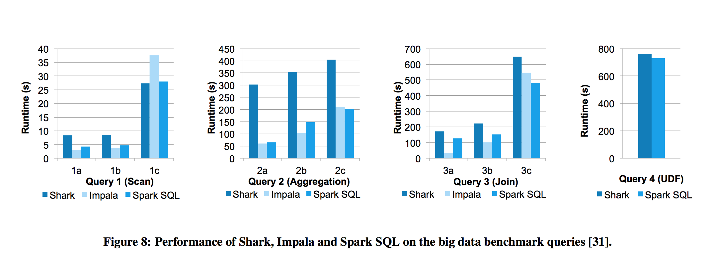
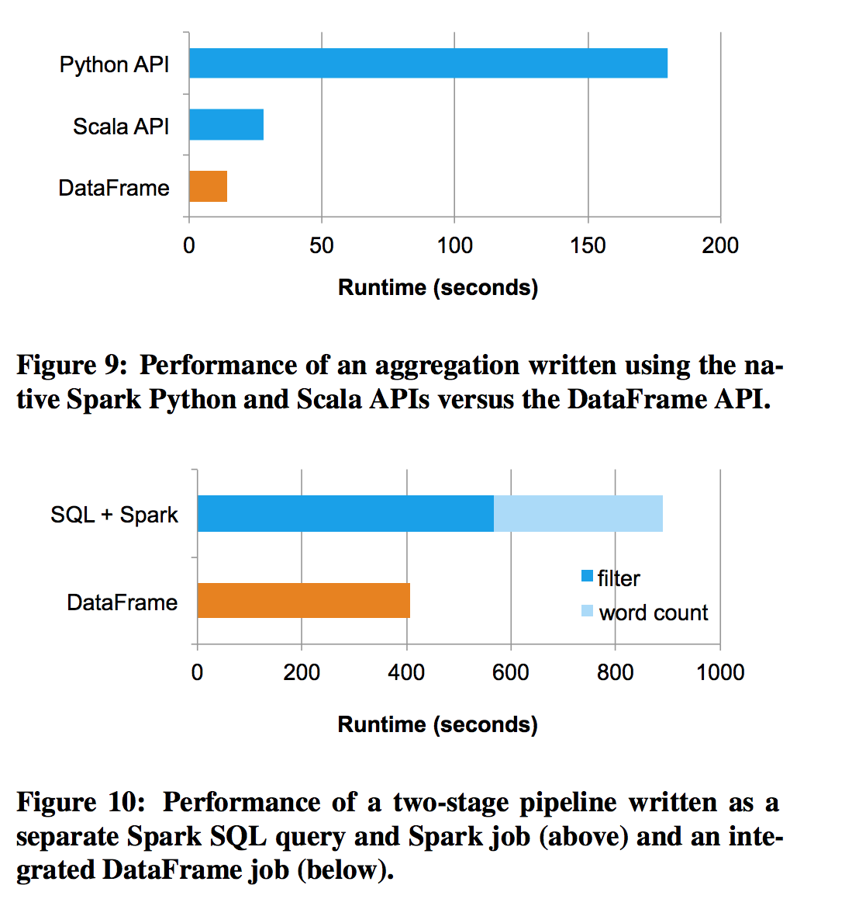

## Spark SQL Concept

*[Reference from Spark SQL paper](https://cs.stanford.edu/~matei/papers/2015/sigmod_spark_sql.pdf)*

- Spark SQL in-memory caching
	Spark SQL **comular cache** (.cache()) reduce memory footprint by an order of magnitude. It applies column compression schemas such as **dictionary encoding** and run-length encoding.
- Spark SQL UDF
	Example: 
	```scala
	val model:LogisticRegressionModel = ...
	sparkSession.udf.register("predict",predict(x:Float,y:Float)=>model.predict(Vector(x,y)))
	sparkSession.sql("SELECT predict(age,weight) FROM uses")

	```
- **Catalyst** is a SQL query optimizer which contains a general library for representing **trees** and applying **rules** to manipulate it. It contains libraries and set of rules below:
	- expressions (1+(2+3))
	- logic query plans
	- analysis
	- logical optimization
	- physical planning
	- code generation


- Trees, Rules
	- Tree is the main data type in Catalyst. like ```Add( Attribute (x), Add(Literal (1), Literal (2)))```
	- Manipulate trees, functions from a tree to another tree. Trees provide a transform mehtod that applies a **pattern matching** function recursively on all nodes of a tree. like:
	```scala
	tree.transform{
		case Add(Literal(c1),Literal(c2)) => Literal(c1+c2)
		case Add(left,Literal(0)) => left
		case Add(Literal(0),right) => right
	}
	```
- Analysis
	- Spark SQL begins a relation to be computed. Either from AST returned by SQL parser or DataFrame object.
	- Both cases my contains unresolved attribute references or relations.
	- Spark SQL building an "unresolved **logical plan**" tree applies rules such as:
		- Look up relations by name from catalog
		- Propagating and coercing types through expressions. e.g. resolve type of 1+col until col is resolve.
- Logical optimization
	- Apply standard rule-based optimizations to the logical plan.
	- Constant folding
	- Predicate pushdown, pushdown the `where` or `filter` to the low level data source engine rather than dealing with the entire dataset after it has been loaded into Spark's memory. See [jacelaskowski's gitbook](https://jaceklaskowski.gitbooks.io/mastering-apache-spark/spark-sql-Optimizer-PushDownPredicate.html)
	- Projection pruning
	- null propagation
	- Boolean expression simplification etc.
- Physical planning
	- Spark takes a logical plan and generates one or more physical plan using physical operators that match Spark exectution engin.
	- It then select a plan using a cost model.
	- Perform rule based physical optimazations.
- Code generation
	- Relies on `quasiquotes`, a scala language feature, like:
	```scala
	def compile(node: Node ): AST = node match {
		case Literal(value) => q"$value"
		case Attribute (name) => q"row.get($name )"
		case Add(left , right) =>
		q"${compile(left )} + ${compile(right )}"
	}
	```
- Extension point
	- Data Sources
		+ All data sources must implement a `createRelation` function and returns a `BaseRelation` object for that relation.
		+ `BaseRelation` can implements several interfaces in order to let spark read the data such as:`TableScan`,`PrunedScan` ,`PrunedFilterScan`
	- Use-Defined Types
		+ Mapping use-defined types to structures composed of Catalyst's built-in types. For example
		```scala
		class PointUDT extends UserDefinedType [Point] {
			def dataType = StructType (Seq( // Our native structure
				StructField ("x", DoubleType ),
				StructField ("y", DoubleType )
			))
			def serialize (p: Point) = Row(p.x, p.y)
			def deserialize (r: Row) =
			Point(r. getDouble (0), r. getDouble (1))
		}
		```
- Spark SQL performance 
	+ Queries
		
	+ API  
		